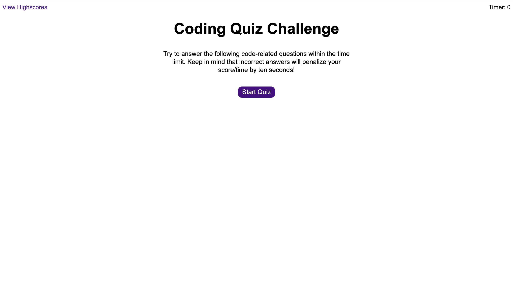
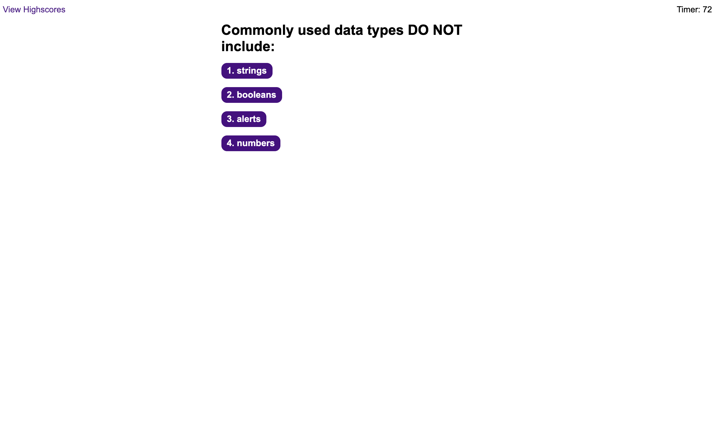
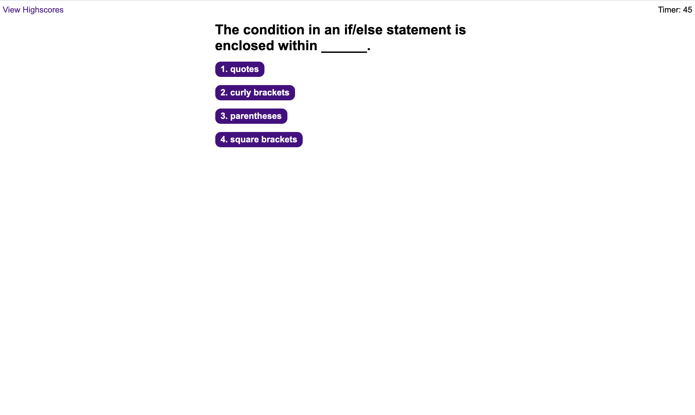
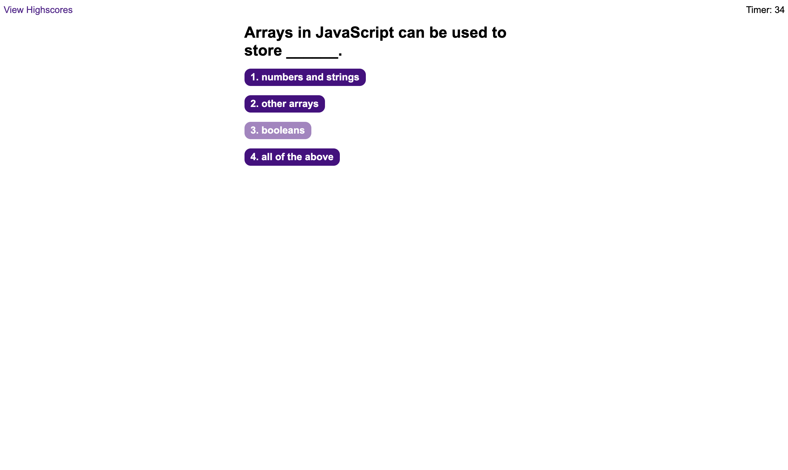
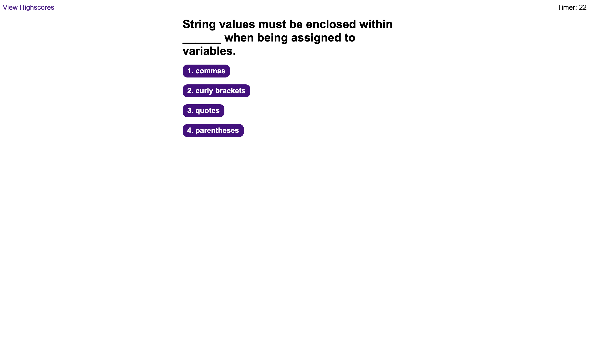
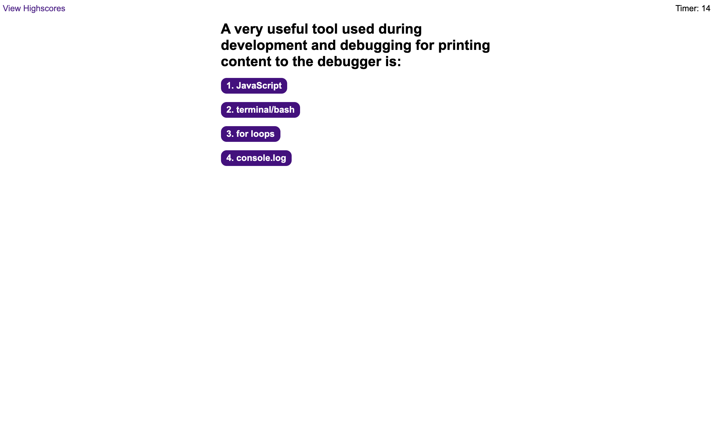
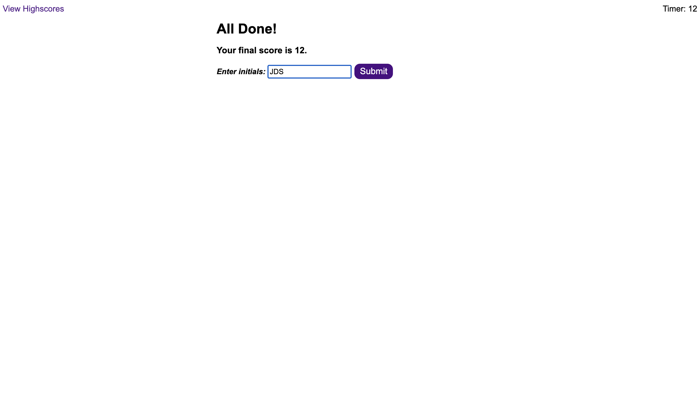
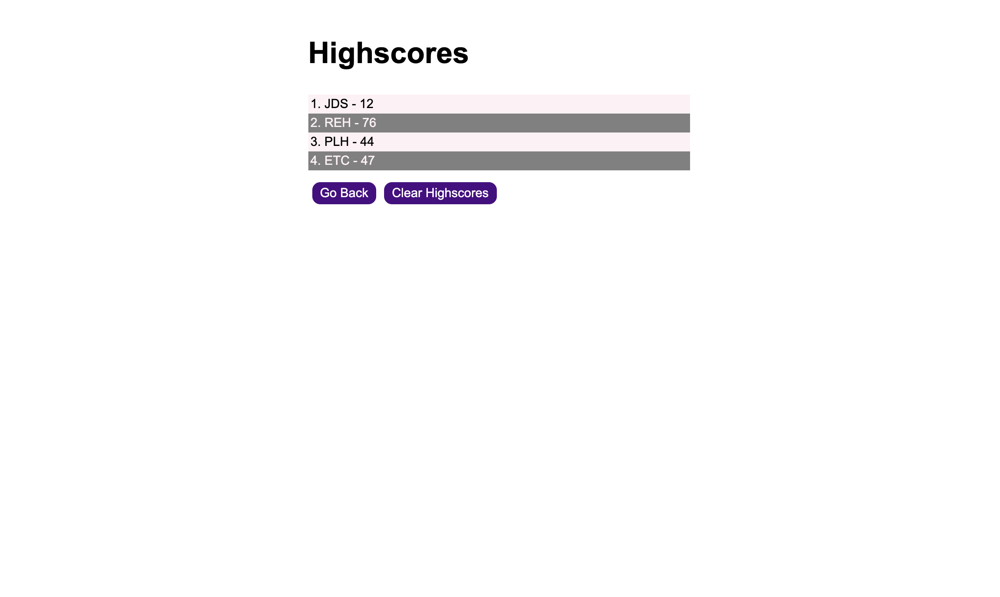

# 04 Web APIs: CodeQuiz

This README has been generated to accompany the completed Code Quiz. The purpose of the Code Quiz is to provide a timed JavaScript quiz with multiple-choice questions that gives immediate feedback for correct/wrong answers. It then saves the user's initials and score to a highscores page that utilizes local storage to display all user initials and scores together in one list. This Code Quiz has been made responsive, ensuring it adapts to multiple screen sizes for broad usability. The goal of the Code Quiz is to simulate basic coding assessments that most web developers encounter during job interviews.

## Link to Deployed Page

[Code Quiz](https://duncangw1.github.io/CodeQuiz/)

## Technologies Used

- HTML, CSS, JavaScript

## Screenshots

Landing Page

---

Question #1

---

Question #2

---

Question #3

---

Question #4

---

Question #5

---

All Done Page

---

Highscores Page

---

## Contributors

- Gene Duncan (duncangw1)

## License & Copyright

© Gene Duncan
